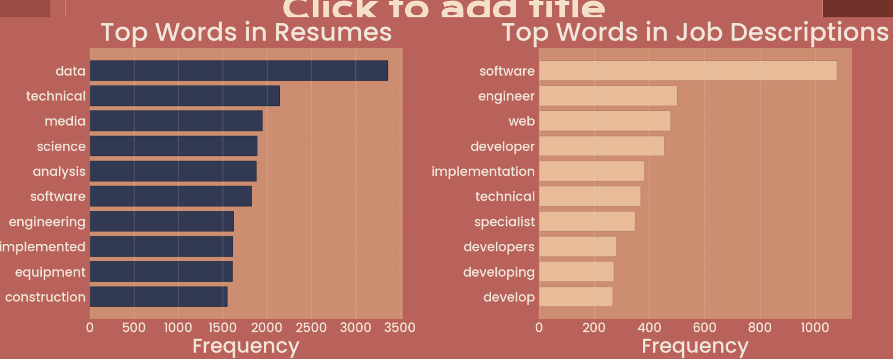
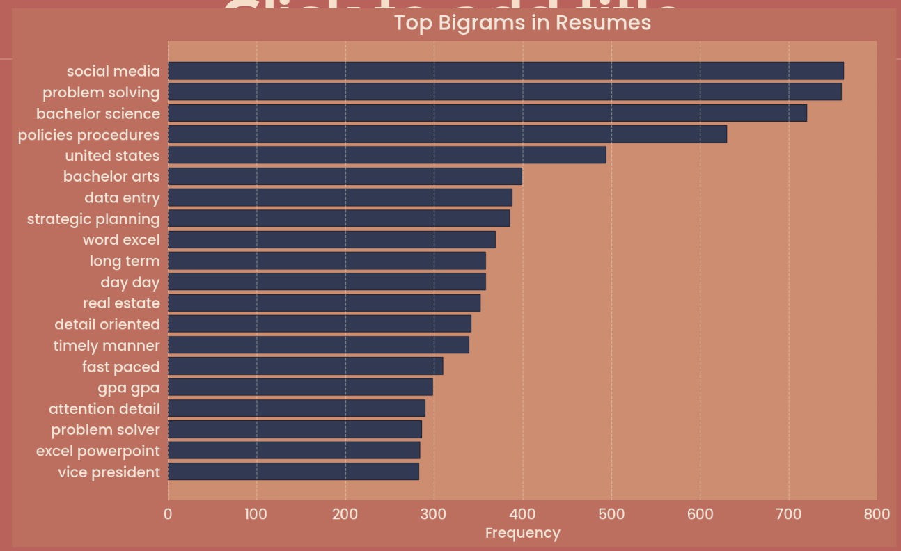
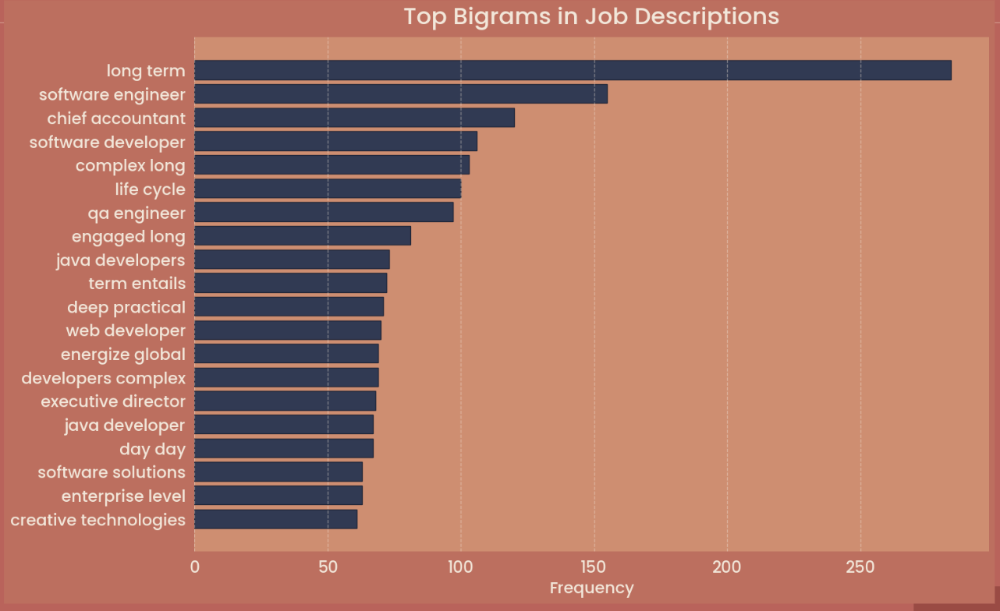
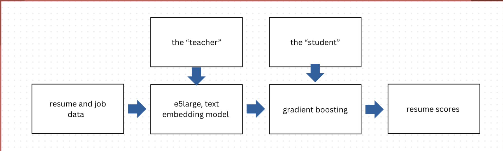
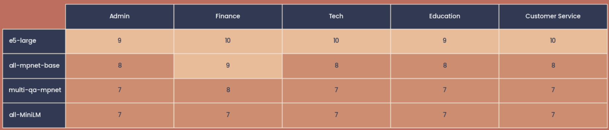
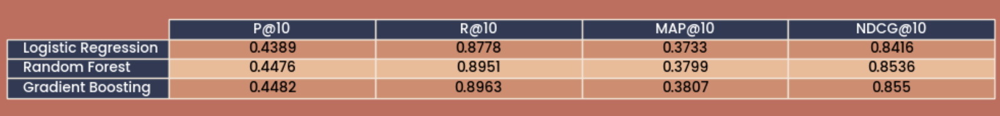

# 🌟 **AI-Assisted Recruitment System**

*A hybrid semantic–ML pipeline for matching resumes to job descriptions with higher accuracy, fairness, and efficiency.*

---

# 📌 **Overview**

Modern hiring teams are overwhelmed. A single job posting can receive **250+ applications**, and recruiters have just **six seconds** to review each resume.
This leads to qualified candidates being overlooked simply because there’s too much information to sift through manually.

**AI-Assisted Recruitment** is a hybrid ranking system that intelligently matches resume with job descriptions by combining:

* **Semantic embeddings** (to understand meaning, not just keywords)
* **Structured ML features** (to capture explicit requirements like skills, experience, and domain relevance)
* **A weighted fusion model** (that integrates both signals for stronger rankings)

Our goal:

### **Stop missing qualified candidates. Improve speed, accuracy, and fairness in screening.**

---

# 🎯 **Objectives**

### We designed the system to:

* Understand resume and job descriptions **beyond keyword overlap**
* Capture structured signals like **experience, degree level, domain skills**
* Rank candidates using **robust, interpretable ML signals**
* Combine semantic and structured features into a **single hybrid score**
* Evaluate performance with **ranking metrics** used in recommendation systems

---

# 📂 **Datasets**

We used two independent, publicly available datasets from Kaggle:

- [Resume Dataset on Kaggle](https://www.kaggle.com/datasets/snehaanbhawal/resume-dataset/data)  
- [Online Job Posts Dataset on Kaggle](https://www.kaggle.com/datasets/madhab/jobposts/data)  

Since no resume → job labels existed, we engineered the entire matching pipeline from scratch.

---

# 🧹 **Preprocessing**

Resumes required heavy cleaning:

* Removed HTML tags
* Normalized casing & spacing
* Fixed broken formatting
* Removed stopwords & boilerplate

Job descriptions were also standardized for comparison.

---

# 🔍 **Exploratory Analysis**

Before modeling, we conducted several analyses to inspect patterns across text types:


### **Top Words**

* Resumes contained many generic words (“year,” “experience”)
* Job descriptions contained more domain-specific terms (“software,” “engineer”)
<p align="center">
  
</p>

### **Bigrams**
<p align="center">
  
</p>

<p align="center">
  
</p> 

* Resumes: *“problem solving,” “strategic planning”*
* Job posts: *“software engineer,” “life cycle”*

### **Domain Keyword Counts**

<p align="center">
  
</p>
Confirmed fundamental distribution differences:
Resumes spanned multiple industries; job posts were almost entirely tech roles.

These insights inspired the **domain-aware features** in our model.

---

# 🧠 **Model Architecture**
<p align="center">
  
</p>


The system uses a **teacher–student hybrid architecture** combining semantic embeddings with a structured ML learner.

---

## **1. Teacher Model — Semantic Embeddings (e5-large)**

Embeddings allow us to compare meaning rather than literal words.
<p align="center">
  
</p>


We used **e5-large**, which:

* Understands semantic similarity
* Handles synonyms + paraphrasing
* Separates unrelated domains
* Produces high-quality vector representations

We compute **cosine similarity** between resume and job vectors to get a semantic match score.

---

## **2. Student Model — Structured ML Features**

Embeddings alone cannot reason about:

* years of experience
* degree type
* seniority cues
* domain-specific skills
* length / completeness of a resume

So we engineered a set of structured, explainable features:

### **Feature Categories**

* Keyword overlap
* Domain skill counts
* Education signals
* Seniority features
* Cosine similarity
* Resume length + density
* Technical vs. non-technical ratios

### **ML Algorithms Tested**

* Logistic Regression
* Random Forest
* Gradient Boosting (**best model**)

Gradient Boosting was most consistent across ranking metrics.

---

## **3. Hybrid Fusion Scoring**

The final ranking uses a weighted combination:

```
FinalScore = α * EmbeddingScore + β * MLScore
```

Why this works:

* Embeddings provide **contextual meaning**
* ML features provide **explicit structure**
* Together, they outperform either approach alone

---

# 📊 **Evaluation & Results**


<p align="center">
  

We used ranking metrics commonly used in search and recommendation systems:

* **Precision @10** – % of top 10 results that are relevant
* **Recall @10** – % of relevant resumes surfaced in the top 10
* **Mean Average Precision @10** – rewards models that push the best candidates early
* **Normalized Discounted Cumulative Gain @10** – measures full ranking quality

### **Key Findings**

* Embeddings alone are strong semantically but ignore structure.
* ML alone captures constraints but fails when wording varies.
* **Hybrid model achieved the highest scoring across all metrics**, especially MAP@10 and NDCG@10.


---

# 🚀 **Next Steps**

Future enhancements include:

* Getting higher quality data which includes a wide variety of seperable domains 
* Adding recruiter feedback loops (active learning)
* Improving fairness and bias detection

---

# 👥 **Team: Cadence Design 1A **


## 👥 Team Members

**[Maliha Tasnim](https://www.linkedin.com/in/mali04/)**

**[Jessica Chen](https://www.linkedin.com/in/chenjessica004/)**

**[Lauren Scimeca](https://www.linkedin.com/in/lauren-scimeca/)**

**[Jadesola Adebayo](https://www.linkedin.com/in/jadesolaadebayo/)**

**[Aditya Jha](https://www.linkedin.com/in/aditya-jha777/)**

**[Emily Klapper](https://www.linkedin.com/in/emilyklapper390/)**
 

Advisors: **[Matt Brems](https://www.linkedin.com/in/mattbrems/)** & **[Farhan Rasheed](https://www.linkedin.com/in/frasheedf/)**

---

# 👩‍💻 **Individual Contributions**

Maliha Tasnim — Contributed to the hybrid architecture, built the embedding + feature engineering pipelines, and led evaluation and visualizations.

Jessica Chen — Worked on preprocessing and feature extraction.

Aditya Jha — Helped with backend setup and embedding experiments.

Lauren Scimeca — Contributed to data cleaning and model architecture testing.

Jadesola Adebayo — Assisted with preprocessing and documentation. 

Emily Klapper — Contributed documentation and used natural language processing techniques. 
